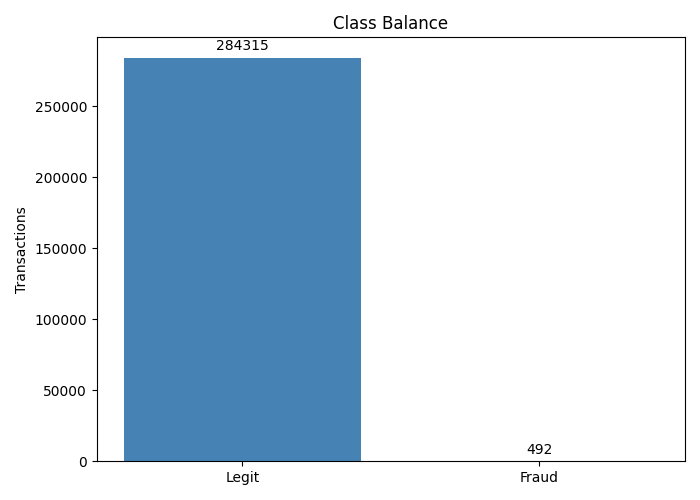
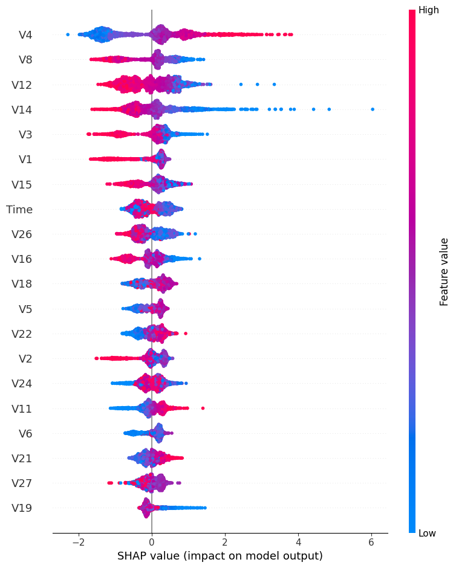
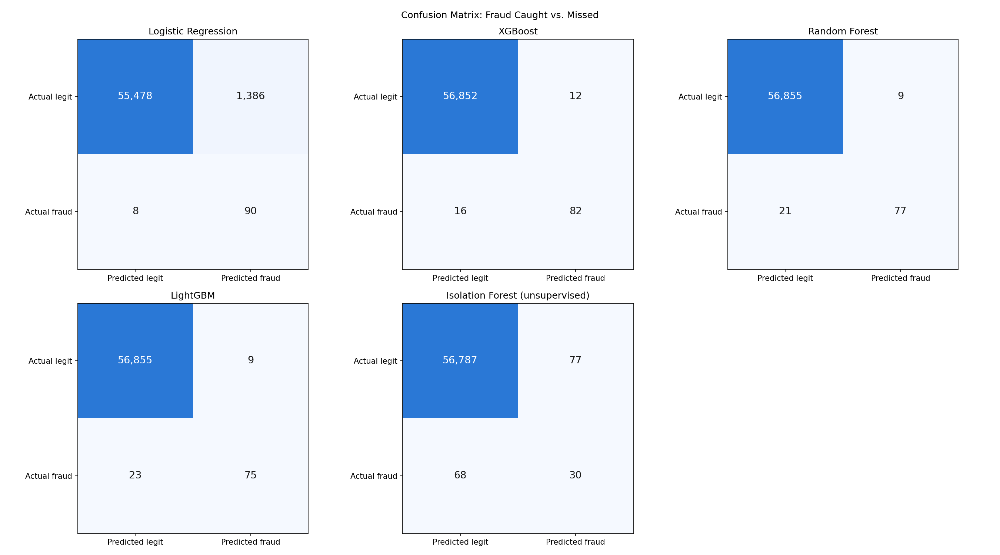
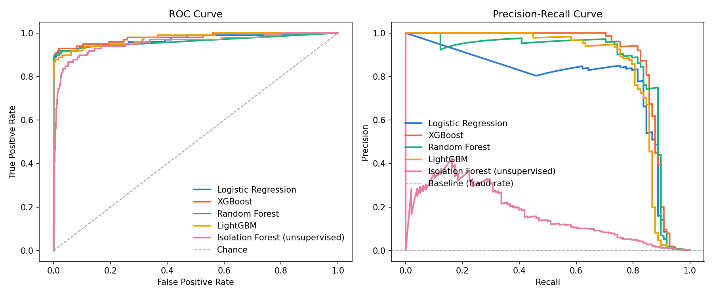
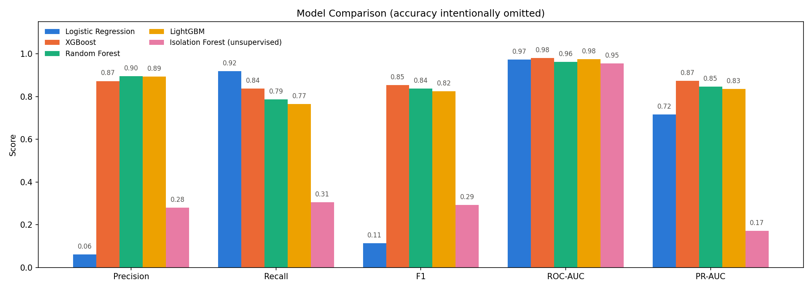

# Credit Card Fraud Detection

A machine learning project that looks at a credit card transaction and decides: **fraud, or legit?** — and then explains *why* it made that call, instead of just spitting out a black-box answer.

Built on real, anonymized data: **284,807 transactions**, of which only **492 are fraud**. That's about **1 in every 580 transactions**.

---

## Why I built this

Think about how many times a card gets swiped or tapped every second, worldwide. Banks can't have a human look at every single one — there just aren't enough humans. So they need a computer program that flags the sketchy ones automatically, in real time, while the transaction is happening.

Sounds simple: "just catch the fraud." But here's the catch — there are two totally different ways to mess this up, and they don't cost the same:

- **Miss a fraud** → the bank just loses that money. Bad.
- **Wrongly accuse a real customer** → their card gets declined at checkout, they get embarrassed or angry, and now customer support has to deal with it. Also bad, just in a different way — and it happens *way* more often if your model is too trigger-happy.

So this isn't really a "how smart is the AI" problem. It's a **balancing act**: catch as much fraud as you can, without annoying a small city's worth of innocent people every day. That tradeoff is the actual point of this whole project.

---

## What this project actually does

1. Takes a big pile of real transaction data and cleans it up
2. Trains **five different models** to guess fraud vs. legit, then compares them head-to-head
3. Asks the best model to explain *which signals* made it suspicious of a transaction
4. Wraps it all in a simple app where you can pick a transaction, see the fraud score, and slide a dial to make the model stricter or looser

---

## How it works, explained simply

**The data.** Each transaction has 30 numbers attached to it. Two of them are things you'd recognize — `Time` and `Amount`. The other 28 (called `V1` through `V28`) are real transaction details that the bank scrambled beyond recognition for privacy — think of it like the actual info (merchant, location, category, etc.) put through a blender so no one can identify a person from it, but the *patterns* in the data survive the blending. Each transaction is also labeled `Class`: `1` if it was fraud, `0` if it wasn't.

**The big problem: almost nothing is fraud.** Only 0.17% of transactions are fraud — that's about 1 in 580. This wrecks a rookie mistake that's worth understanding, because it trips up a lot of beginners:

> If a "model" just guessed **"not fraud"** on literally every single transaction, it would be **right 99.83% of the time.** Sounds amazing — except it just let 100% of the fraud through. It's a useless model wearing a 99.83% costume.

This is called the **accuracy trap**, and it's exactly why "accuracy" is never mentioned as a real metric anywhere in this project.



**So what do we measure instead?** Two simple questions, plus one score that combines them:

- **Precision** — "Of all the transactions I called fraud, how many actually were fraud?" (Low precision = crying wolf a lot — lots of innocent people getting flagged.)
- **Recall** — "Of all the fraud that actually happened, how much did I catch?" (Low recall = a lot of fraud slipping through untouched.)
- **PR-AUC** — one number that captures how good the precision/recall tradeoff is *overall*, across every possible strictness setting, not just one. This is the single most important number in this whole project — more on why below.

**The five models — and why five, not one.**

- **Logistic Regression** — the simple, classic baseline. I told it to pay extra attention to the rare fraud cases so it wouldn't just ignore them.
- **XGBoost** — a much more powerful model made of hundreds of small decision trees working together. I told it that each fraud example should "count" about 580x more than a normal one during training, to make up for how rare fraud is.
- **Random Forest** — another decision-tree-based model (a different recipe than XGBoost), also told to weigh fraud cases more heavily. A second strong opinion to compare against.
- **LightGBM** — similar idea to XGBoost, built for speed. Unlike the other three, it's deliberately trained **without** class reweighting (`scale_pos_weight=1`) — see below for why that's the right call here, not an oversight.
- **Isolation Forest — the odd one out.** This model is **unsupervised**, meaning it's never shown which transactions are actually fraud during training — no answer key, no cheat sheet. It only looks at the transaction data and learns what "normal" looks like, then flags whatever looks the most different from everything else as suspicious. Why include it? Because in the real world, brand-new types of fraud show up *before* anyone has labeled examples of them. An unsupervised model is what you'd lean on to catch the stuff nobody's seen yet.

**Explaining the "why."** A fraud team isn't going to trust a model that just says "trust me, it's fraud" with no reasoning. So I used a tool called **SHAP**, which basically interrogates the model and produces a chart showing which features pushed a prediction toward "fraud" and which pushed it toward "legit," and by how much.



### So what does the model actually key on?

The model wasn't handed any human-written fraud rules — it learned patterns from the 492 labeled fraud examples. For a tree-based model like XGBoost, a single prediction is really the sum of hundreds of tiny learned yes/no splits on feature values (e.g. "is V14 below X? lean fraud"), not one clean rule.

**Top features driving fraud predictions for the shipped model, ranked by mean |SHAP value| on the same 2000-row sample as the chart above:** V4, V8, V12, V14, and V3.

The honest limitation: since V1–V28 are anonymized PCA components, SHAP can tell us *which* features mattered most, but not *what they mean* in the real world (merchant, location, spending category, etc.) — that detail was scrambled away for privacy. In a real deployment working with the original, unscrambled features, this same SHAP process would give a fraud analyst an actual human-readable reason for each flagged transaction, not just a ranked list of anonymous variables.

---

## What I found

Here's all five models, ranked by PR-AUC (the tradeoff score explained above — higher is better):

| Model | Precision | Recall | F1 | ROC-AUC | PR-AUC | Fraud caught / missed | False alarms |
|-------|-----------|--------|----|---------|--------|----------------------|--------------|
| **XGBoost** | **0.872** | 0.837 | **0.854** | **0.979** | **0.873** | 82 / 16 | **12** |
| Random Forest | 0.895 | 0.786 | 0.837 | 0.962 | 0.847 | 77 / 21 | 9 |
| LightGBM *(unweighted, `scale_pos_weight=1`)* | 0.893 | 0.765 | 0.824 | 0.975 | 0.834 | 75 / 23 | 9 |
| Logistic Regression | 0.061 | 0.918 | 0.114 | 0.972 | 0.716 | 90 / 8 | 1,386 |
| Isolation Forest *(unsupervised — no labels used)* | 0.280 | 0.306 | 0.293 | 0.954 | 0.172 | 30 / 68 | 77 |

**Translating that into plain English, model by model:**

- **Logistic Regression** caught almost every fraud (91.8% of it!) — but to pull that off, it also falsely accused **1,386 real customers**. Imagine 1,386 people getting their card declined mid-purchase because a simple model got spooked. Not something a real bank could ship.
- **XGBoost** caught slightly less fraud (83.7%) but only falsely accused **12 people** instead of 1,386. That's a massive upgrade in real-world usability — and it has the best overall PR-AUC of the five.
- **Random Forest** performed almost identically to XGBoost — even fewer false alarms (9!), but it also missed a few more actual frauds (21 vs. 16). A very close second place.
- **LightGBM**, trained with no class reweighting at all, lands right behind Random Forest — precision and false-alarm count both essentially tied with it. That's not a lucky default; it's the payoff of a finding worth its own section below.
- **Isolation Forest**, remember, never saw a single labeled fraud example. Despite that huge handicap, it still did way better than random guessing (0.172 vs. a random baseline of about 0.0017 — over 100x better). It's just nowhere near as good as the models that got to study with an answer key. That gap is basically "the price you pay" for not having labeled data — a very real cost in actual fraud systems, where brand-new scams show up before anyone's labeled them.

### The LightGBM finding: reweighting for imbalance can hurt a ranking metric

**The headline: giving LightGBM the "textbook" imbalance fix — the same `scale_pos_weight` trick that works great for XGBoost — actively made it worse. Removing it entirely turned LightGBM from the worst model in this project into a solid third place.**

Here's the reasoning, one piece at a time:

**1. PR-AUC is a ranking metric, not a threshold metric.** It never asks "what did the model predict at 0.5?" It asks: *across every possible cutoff, does this model consistently score real fraud higher than legit transactions?* That's a completely different question from "how many false alarms did it raise today," which is a snapshot at one specific cutoff. A model can look bad on one and fine on the other — which is exactly what happened here.

**2. Aggressive class reweighting made LightGBM's ranking worse, not better.** I swept `scale_pos_weight` — the "make each fraud example count N times more" knob — from 1 (no reweighting) up to 577 (the textbook neg/pos ratio, same value used for XGBoost), keeping every other hyperparameter fixed:

| `scale_pos_weight` | 1 | 2 | 5 | 10 | 20 | 50 | 100 | 200 | 577 (full ratio) |
|---|---|---|---|---|---|---|---|---|---|
| PR-AUC | **0.834** | 0.300 | 0.487 | 0.318 | 0.293 | 0.237 | 0.200 | 0.128 | 0.060 |

Turning the reweighting *up* pushed PR-AUC *down*, almost the whole way. The best score in the entire sweep is at weight = 1 — in other words, the "fix" for the imbalance was the thing breaking the model.

**3. XGBoost shrugged off the exact same reweighting; LightGBM didn't.** Both models were handed identical `scale_pos_weight=577`. XGBoost turned that into its best result in the project (PR-AUC 0.873). LightGBM turned it into its worst (PR-AUC 0.060). A plausible reason — **worth stating clearly as a hypothesis, not a proven fact**, since I haven't dug into the tree structures directly to confirm it — is that LightGBM grows trees leaf-wise (it keeps splitting whichever single leaf reduces error the most, anywhere in the tree), while XGBoost's default grows tree level-by-level. When the rare fraud examples suddenly count 577x more, leaf-wise growth has an incentive to keep chasing them anywhere it can, which can warp the tree structure around a tiny slice of the data and inflate predicted fraud probability for many ordinary transactions that happen to share surface features with fraud. That would explain why the damage gets worse as the reweighting gets stronger, and why an algorithm that doesn't chase individual leaves as aggressively wouldn't show the same effect.

**4. The conclusion this project ships with: when your metric is rank-based, fix imbalance at the threshold, not in the loss function.** Instead of asking the model to distort its own scoring to compensate for rarity, leave the model to rank transactions as well as it naturally can (`scale_pos_weight=1`), and handle the imbalance downstream — at the decision threshold. That's precisely what the **threshold slider in the app** is for: it lets you pick where to draw the line between "flag it" and "let it through" after the fact, based on the real-world cost of a false alarm vs. a missed fraud, without ever having to fight the model's own ranking. Reweighting during training and adjusting the threshold after training are trying to solve the same problem — for LightGBM here, only one of them actually worked.

**The confusion matrices** — literally "how many did each model get right vs. wrong," fraud caught vs. fraud missed vs. false alarms, side by side for all five:



**The ROC and Precision-Recall curves** — instead of judging each model at one fixed strictness setting, these show how each one performs across *every* possible setting. Look at the right-hand chart (Precision-Recall) more than the left — under this much imbalance, the left chart (ROC) can make weak models look deceptively good:



**All five metrics, side by side, for every model:**



---

## Which model would I actually ship?

**XGBoost.** Trading a small amount of caught fraud for going from 1,386 false alarms down to 12 is an easy call — that's the difference between a system a bank could actually run and one that would flood their support team and infuriate customers. A slightly-lower catch rate is a very fair price for not falsely accusing over a thousand real people.

And this isn't a fixed, forever decision — the app has a **threshold slider** built in specifically so the business can dial this in themselves after launch: turn it down to catch more fraud (at the cost of more false alarms), or turn it up to bother fewer innocent customers (at the cost of missing a bit more fraud). It turns a technical choice into a business choice, which is exactly where it belongs.

---

## If this were actually running in production

- **Retrain it regularly.** Fraud tactics evolve — a model trained today will slowly go stale. Retrain on a rolling schedule (e.g., monthly) so it keeps up.
- **Watch for drift.** Set up alerts for when incoming transactions start looking meaningfully different from what the model originally learned — that's often the first sign it needs retraining sooner than scheduled.
- **Treat the threshold as a dial, not a constant.** The "right" strictness depends on the real dollar cost of a missed fraud vs. the real cost (in support tickets and lost trust) of a false alarm — and that cost can shift over time.
- **Watch it live, not just in testing.** Track fraud caught, fraud missed, and the false-alarm rate on real, ongoing traffic — a model can look great on a test set and still degrade once it meets the real world.

---

## How to run it yourself

```bash
pip install -r requirements.txt

# download creditcard.csv from Kaggle and put it in data/
# https://www.kaggle.com/datasets/mlg-ulb/creditcardfraud

python src/eda.py        # explore the data + save charts
python src/train.py      # train all five models + save results
python src/explain.py    # generate the SHAP explanation chart
streamlit run src/app.py # launch the interactive app
```

## Tech used

Python · pandas · scikit-learn · XGBoost · LightGBM · SHAP · Streamlit
